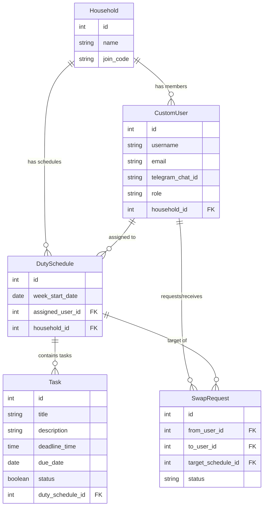

# Architecture: Shared Household Chores Tracker

This document outlines the high-level architecture and data models for our Django-based application, which supports isolated households for roommates and large families.

## High-Level Architecture

Our app follows a classic monolithic MVC (Model-View-Controller, or MTV in Django terms) pattern. Background tasks for Telegram notifications are handled by a standalone cron job running a custom Django management command.

```mermaid
graph TD
    User([User (Roommate/Family)])
    Admin([Household Admin])
    Telegram([Telegram API])
    
    subgraph Django Application
        Views[Django Views & Templates]
        Models[Django ORM (Models)]
        Command[Django Management Command]
    end
    
    Cron((System Cron))
    DB[(SQLite/PostgreSQL)]

    User -->|HTTP GET/POST| Views
    Admin -->|HTTP GET/POST| Views
    
    Views <-->|Read/Write| Models
    Models <-->|Queries| DB
    
    Cron -->|Every 3 Hours| Command
    Command -->|Read| Models
    Command -->|Send| Telegram
    Telegram -.->|Notifications| User
```

## Technical Stack & Versions

- **Python:** `v3.14+`
- **Web Framework:** `Django v6.1`
- **Background Scheduler:** `System Cron` (Linux/macOS) invoking a custom Django management command.
- **HTTP Client:** `requests v2.34.2`
- **Database:** `SQLite` (built-in, development/MVP) / `PostgreSQL` (production)
- **Frontend / Styling:** Vanilla HTML/CSS with modern native web features (Grid, Flexbox, custom properties).

## Data Models

The core entities revolve around tracking households (families/apartments), users, schedules, specific tasks, and swap requests. 



## Component Breakdown

1. **Frontend (Django Templates):**
   - Server-side rendered HTML using Django's templating engine.
   - Styled with modern Vanilla CSS for a premium look.
   - Core pages: Dashboard (current tasks), Schedule & Swaps, Household Management (Admin).

2. **Database:**
   - **SQLite** for development and MVP. Easily upgradeable to **PostgreSQL** in the future.
   - Django ORM handles all database interactions.
   - Multi-tenancy is handled via the `Household` foreign key on users and schedules.

3. **Background Notification System:**
   - **System Cron**: We will write a custom Django management command (`python manage.py send_telegram_reminders`).
   - The OS `cron` will trigger this command every 3 hours.
   - The command queries the `Task` model for incomplete tasks due today, looks up the assigned user's Telegram via the `DutySchedule`, and sends a message using the `requests` library.
